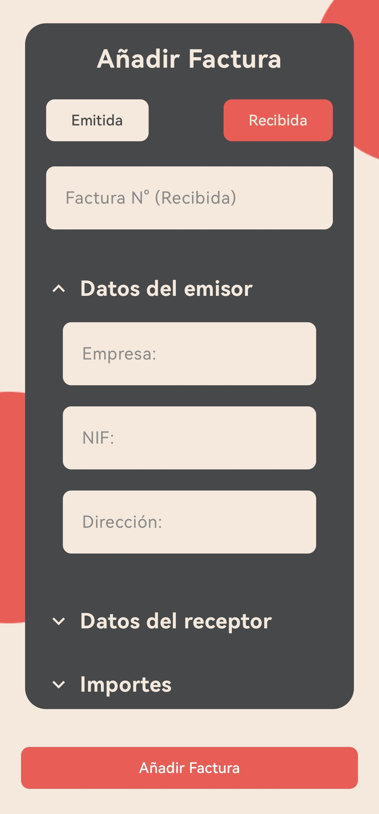

# Facturador

Facturador is a mobile application designed to optimize and simplify invoice management for freelancers. It centralizes the registration of issued and received invoices, facilitating financial organization and offering a clear view of their professional activity.

## About

Facturador is a mobile application developed to provide a complete digital solution for invoice management for freelancers. Built with a focus on efficiency and ease of use, it allows users to intuitively manage critical aspects of their invoicing, enabling them to focus on their core activities.

Designed with scalability and adaptability in mind, Facturador serves as a central hub for the daily management of invoices, becoming an indispensable tool for any self-employed individual looking to improve their productivity and maintain a well-organized workflow. This application is part of a broader project called Intermodular, which includes a web platform and an interactive dashboard for comprehensive management.

## Key Features

* **Invoice Registration:** Easily add and manage the details of your issued and received invoices.
* **Secure Authentication:** Access your information securely with a login system protected by Firebase Authentication.
* **Key Fields:** Save essential information such as date, invoice number, VAT ID, taxable base, VAT, personal income tax (IRPF), and total.
* **Real-time Synchronization:** Keep your data synchronized with the web platform and dashboard thanks to Firebase integration.
* **Intuitive Interface:** Clean and easy-to-use design, developed with Jetpack Compose for a fluid user experience.

## Technologies 

Facturador is built using the following technologies:

**Frontend:** Kotlin with Jetpack Compose
**Backend & Database:** Firebase (Firestore and Authentication)

## Screens

1. **Inicio de Sesión:** Pantalla para que los usuarios se autentiquen y accedan a la aplicación.

   

2. **Formulario para facturas emitidas:** Pantalla con un formulario para poder rellenar con los datos de las facturas. Al introducir la base imponible, se puede elegir el tipo de IVA y el IRPF, calculando el total de forma automática e instantánea. Permite guardar o cancelar la creación de la factura.

   

   

   

3. **Formulario para facturas recibidas:** Igual que el formulario de emitida, con la diferencia de que tienes que rellenar a mano el campo del número de factura. Permite guardar o cancelar la creación de la factura.

   
